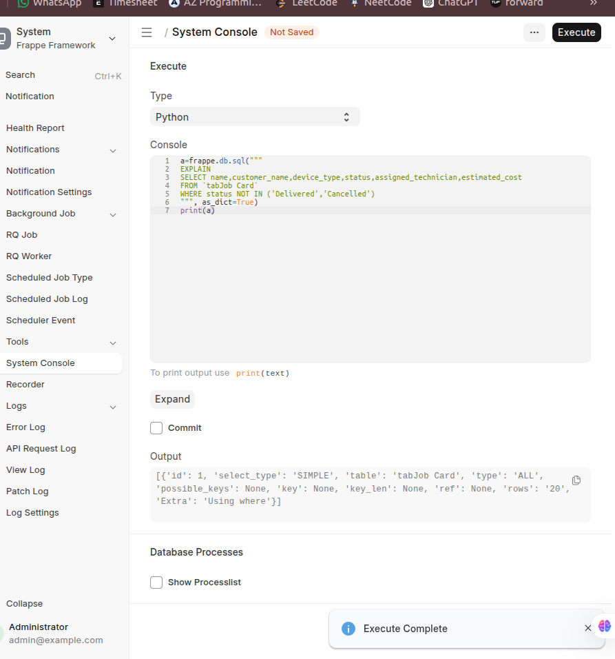
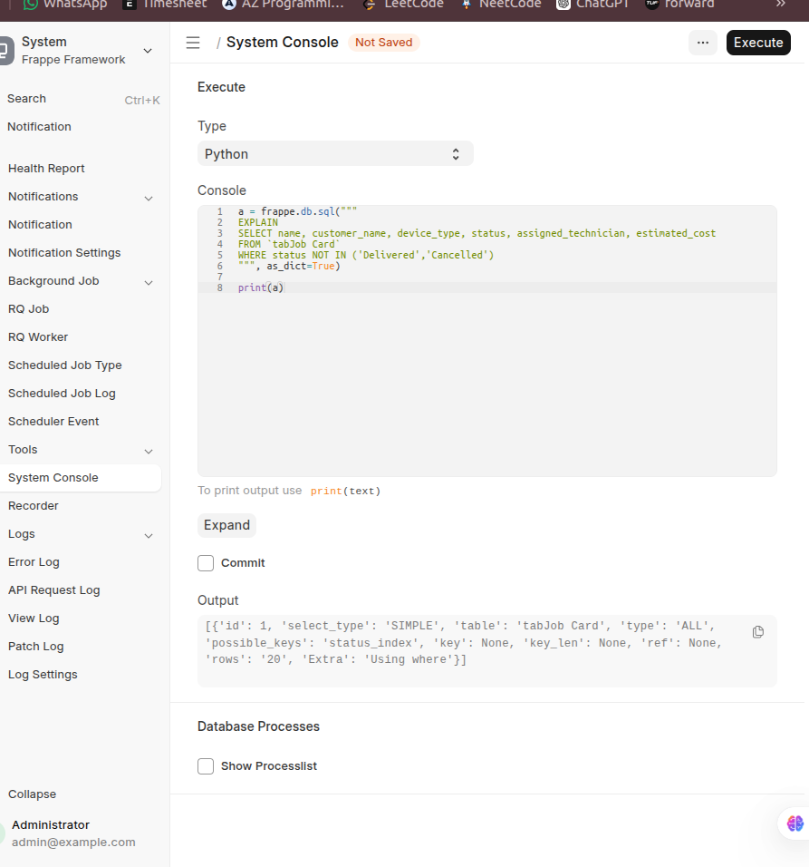
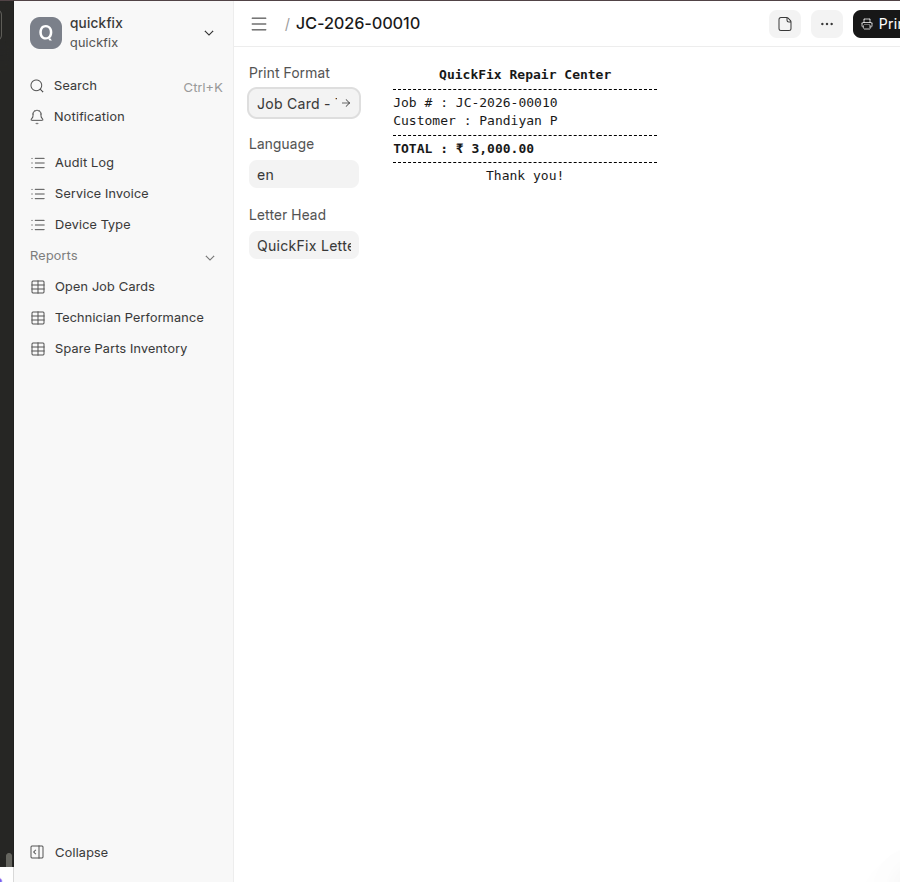

A2 - Multi-Site & Configuration :

1. Actually the site config file is used to store the db name, db password,api key,api key password like that and each site contains the separate site config file.
 
* if some secrets is shared in common_site config file it has been accessed for all sites it may creates vulnerability and may access other sites data's and may also access the api and it's secret keys and common_site_config contains general data's like background workers,gunicorn,socket.io,etc...

2. if we hit the command bench start it will goes to procfile in that file contains the web,socket.io,watch,schedule,redis cache and queue 

## Queue Names in Quickfix

There are three main queue names used for background jobs:

- **default**: For standard tasks that do not require special timing or resources. Use for most jobs that are neither urgent nor long-running.
- **long**: For jobs that require extended processing time (e.g., report generation, heavy computation). Use when a task may take several minutes or more; set a higher timeout as needed.
- **short**: For quick, lightweight tasks (e.g., sending emails, notifications). Use for jobs that should finish rapidly and not block other tasks.

**When to use each:**
- Use `default` for typical business logic and background tasks.
- Use `long` for scheduled reports, data exports, or anything needing more than a few minutes.
- Use `short` for fast operations like sending emails or alerts.

Example:
```
frappe.enqueue("quickfix.api.generate_monthly_revenue_report", queue="long", timeout=600)
```

* the web will initialize the http port to start
* worker is used to finish a job given by redis_queue or any background jobs in developer mode it contains only one worker 
* scheduler is used to trigger the cron jobs and it queued to redis_queue at correct time to accomplish the job 
* socket.io is used to communicate the realtime without db hit first the client intimate to upgrade the socket io it goes to realtime.js and it navigate to index.js file to make the socket.io it is used realtime monitoring

if the worker is failed while do the job it will creates the log in logs/worker.error.log in this file if it is finished logs/worker.log like finished with this seconds like that all the maintained in logs but it does not affect any other jobs.


C1- Child Table Internals :

1. 4column - idx, parent,parenttype,parentfield
2. tabPart Usage Entry
3. if we delete the idx 2 in child table it automatically change the idx value like how many item contains in the child table if the item contains 2 it will create idx 1 and idx 2.

C3-Renaming task :

1.the technician name has renamed in technician doctype it will also reflect in jobcard doc also because assigned technician field has linked field so it changed, this an actual standard frappe behaviour .
2.track changes do whatever changes made in the doc it will show below in the doc and it was enable the check button track changes button in doc.
3.the unique does not allow the duplicate values in column in the table ig the the column index has unique it does not allow the duplicate values in a table .
the validate function in frappe act as before saving the form it checks all the given functions inside the validate function , Inside that it checks the example "if frappe.db.exists("Customer",{'email':"pandiyan@gmail.com"}) " if runs inside the validate function .if any error or does not exists it does not allow to save the form.

D1 and D2:
frappe.get_all bypasses all the permission and it fetching all the details so it is unsafe .

the permission query conditions is used to apply automatic row-level filtering to list queries so it has applied for get_list and get_list gives respect for permissions so it applies the permission_query condition and get_all does not applyies any permission_query_conditions.

E1 : Complete Job Card Lifecycle

while we calling the save in on_update it recursivly calling the save function and while calling this it may arise recursion error 

E2: autoname & Renaming

if we put merge=True it has delete already data and replce the new data it has been overridden and , if merge=false it handles proper renaming it does not loss any data while renaming and it also safer to rename the field and it safe for production side also and it update where ever the fields links.

E3-part -B

when to choose override_doctype_class over doc_events

in frappe there os two common ways to customize the behavior of a doctype: override_doctype_class and doc_events.
1.docevents is generally safer and it additinally added the events to existing events like validate,before_save..
2.override doctype class replaces the entire doctype class with custom class .

-use doc events for simple event-based customizations 
-use override doctype class only in deep modificaation of the doctype class behaviour is required.

the doc event is more safer .


F1-doc_events:
task-b:

i'll added two validate one is for priority in jobcard.py in the method validate() and i added in hooks.py inside that doc_events -> "Job Card" :path name 

it first executes the contoller method and next goes to doc_events in hooks file.


F3-asset ,jinja & website hooks:

Asset- 

app_incluse.js- this loads javascript files globally where we want to use that specifically and it also used as interface such as administrator, the main example when adding functionality to frappe desk ui such as dashboard widgets or any client scripts

web_include.js- it includes only js on website or portal pages and they are accessed by public web interface.

ex- portals,customer-features.

doctype_js- this runs only when a specific doctype form opens for an example job_card.js file activated when the doc opens.

doctype_list_js- it is used to load list view of the doc and it is an access the form control outer side.

doctype_tree_js- this is view like hierarchical doctype ex-in erp the chart of account.
it is used when doctype represents hierarchical data and is displayed using tree structure.

cache busting- when we change the js files ,the browser caches old details, so the new changes won't appear immediately after refreshing the browser it will clear and loads properly.

bench build- it compile the js and css files and it generate the new hashed file name because the code will changed so it genrated the hash .

jinja hooks- 

printformat- the frappe pass the doc automatically to print the details present in the document 

2.web pages- in web pages there is no automatic doc object is passed the data muat be passed explicitly from python controllers it contaisn custom format to print.

F4- override whitelist method:

override_whiteist_method is a frappe hook that allows developers to replace an existing whitelist api method with a custom implementation the override is defined explicitely in hooks.py file and this not require the modifying the original freamwork code.

monkey patch is a technique where a function or method is replaces during runtime using python imports.this modifies the behaviour of the framework internally without any explicit hook configuration.

override_whitelist_method should be prefer whenever a whitelisted api method needs to be replaced .

TWO apps both register override_whitelisted_methods for the same
method:

ans: if two apps override same method the last app override method wins.


signature mismatch :

original method : get_count(doctype, filters=None, debug=False, cache=False)

when we calling custom_get_count(doctype, filters):

in that time it arises the typeerror :missing required positional argument (..)


F5: Fixtures and property setter in install:

fixtures allow exporting configuration such as custom fields ,property setter ,roles,and workspace fraom database to json file store in the application repository. this ensures that configuration changes are version-controled and automatically applied when the app is installed on another site .

property setters allow modifying existing doctype properties without changing the core frameworks files.this ensure upgrade safe customizations.

fieldname collision can occue if a custom field uses the same fieldname as a filed introduced in a future framwork update .this can cause database conflicts during migrations.to avoid this risk,custom field should be prefixed with application name .

Example :

quickfix.patches.v1.create_custom_field
quickfix.patches.v1.update_existing_data

patch 1 creates field tracking_id and patch 2 reads the field if the patch runs it first create the field and update the data 

if they merged it may cause the unknown column 'tracking_id".

G1-safe monkey patch :

the _qf_patched is an attribute acts as a guard to ensure that monkey patch is applied only once

without this the patch function could run multiple times during lifecycle. 

isolating monkey patch:

isolating monkey patches in a dedicated file improves maintainablity ,if patches scattered in init.py or any other modules they become difficult to track and debug .since init.py runs every time the module is imported .
by placing all monkey patches in monkey-patches.py the application has contolled application of patchs using apply_all() function.

escalation path:

1.doc_events - is the safest option because it hooks into existing document lifecycle events without modifying the framework code.
2. override_doctype_class allows extending a doctype class while still preserving core behaviour via inheritance 
3. override whitelist_methods replaces a specific api endpoint through a controlled hook/

4. monkey patch modifes framework functions directly at runtimethis is the riskiesr approach because it depends on internal framwork implementation details and may break during upgrades.

therefore monkey patch should be used when no official hook exists to achieve the required behaviour.

i think the flow will work like this :
application start -> apply_all() -> patch get_url() -> _custom_get_url -> prefix added 

H1-job card form scripts:

frappe.call- frappe.call inside validate does not work.because frappe.call is async 
because the validate () is triggered and frappe.call() request sent in that time the validate finishes and doc saved .

onload & refresh :
this two methods are async because these events happens after the form is rendered,so async calls do not interfere with the save lifecycle

onload- only when form loads
refresh- ecerytime form refreshes.

H3-list view and tree view

1.tree doctype is used to represent hierarchical data structures where records contains parent child relationship

example- chart of accounts.

in this doctype it showed tree structure where nodes can expand or collapse to show child records.

parent_field stores the node referance
is group it identifies whether the node contain children,if true the records acts as a group node.

doctype_tree.js- it is used to customize the behaviour of a tree doctype
it allows custom button filters and ui customization in tree doctype.

H4-client script doctype vs shipped js:

frappe allows frontend customization in two ways:

1.client script - it is created from ui and stored in the database
advantage:
1.no deployment required
2.quick customization
3.easy for consultants

disadvantage:
1.not version controlled
2.harder to maintain across environments
3.risk of script conflicts

shiped JS- this is an written in application code

advantage-
1.version controlled using git
2.better maintainability
3.safer for production environments.

disadvantage-
1.requires deployment
2.needs developer access.

Security pitfall- hiding fields with javascript

hiding fields using javascript only affets the user interface , but the field can access via api call .

I1 -query report with sql safety :


the query performance was analyzzed using the EXPLAIN statement in bench console.
the output showed possible_keys:status_index ,which confirms that  index exists on the status column


The output showed possible_keys: status_index, which confirms that an index exists on the status column.

I4-Prepared Report:

real time script report :
this script runs immediately whn the user clicks run and it fetches data and computes the results on ui.

Prepared report:

this report runs in the background using a worker and stores the result.

when to use :
1.realtime:
- small datasets
- immediate results required
- interactive analysis

2.prepared:
- large datasets
- complex computations
- scheduled generation

staleness trade-off 

prepared reports return cached data until manually refreshed ,so data may be stale.

caching risk -
the main risk of prepared reports data is inconsistency like the report does not reflect those changes and user see outdated values.

I5-report builder and custom report:

report builder is a no code tool used to quickly create reports from a single doctype , it is simple report and it mainly used in no complex calculation

script builder -

this reports are used when custom logic or any features required.
use-
-complex calculation
-aggregations across multiple doctypes


J1 - jinja print format -job card receipt

in jinja template we use frappe.get_all it becomes very messy and hard to debug and also if wee put inside a for loop on jinja tempate it may occurs N+1 pblm 

2.instead of running query inside the template we may run before template even loads inside the python controller using before_print() hook.


j2-raw printing vs html to pdf:

raw printing(esc,pos):binary commands sent directly to thermal printer,no html,no css.
html to pdf means jinja template goes to html and makes pdf via rendering engine,it supports full layout,fonts,table.

format_value= it for mat the value present on doctype for an example 3000 is final amount means it formats as 3,000

3css not supported:
display:flex
position:fixed
box-shadow

completed - 

k- task-A

short- for fast ,lightweight task that must finish quickly and if a slow job enters in this queue it blocks other quick jobs 
use-sending mails,sms

default- for standard background tasks of moderate weight ,this is default when no queue is specified.
use-small reports,syncing records.

long- for heavy time consuming operations use long queue like monthly reports bulk data migrations,etc..